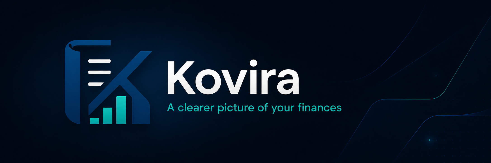

  

A personal ledger built for the way money actually moves: cash in pocket,
mobile wallets, bank accounts, and the IOUs in between.

Built with Flutter. Android-first. Offline by default. No accounts. No ads.
No tracking.

---

## Why Kovira exists

Most finance apps assume you have one bank account that syncs automatically,
and that every unit of money you spend leaves a digital trail behind it.
That's not how money works for most of the world.

Kovira is built for the mixed economy — where some money is cash, some is in
a mobile wallet, some is a bank balance, and a surprising amount of it is an
IOU between you and someone you know. All of it real, none of it fitting
neatly into what existing apps expect.

## What makes it different

- **Multi-account from day one.** Cash, mobile wallets, and bank accounts
  are first-class peers. Transfers between them are a core flow, not an
  afterthought.

- **Dues, tracked honestly.** Log what you owe as a
  proper dashboard item. Clear it fully or partially when you pay. No
  pretending an entry is settled just so the app accepts it.

- **One-tap income buttons.** Salary, rent collected, freelance payment,
  family transfer — assign each to a button. Tap once, money's in. Optional
  monthly reminder so you don't forget the days they normally arrive.

- **Bills that know the difference.** Fixed bills record instantly. Variable
  bills ask the amount each time. You decide which account pays, at the
  moment of payment, not at setup.

- **Goals tied to real money.** Set a savings goal, contribute from any
  account, watch the balance drop and the goal fill up. Withdraw to any
  account when you spend it. Not a wishlist counter — actual money movement.

- **Monthly budgets with month-by-month overrides.** Set a default cap per
  category. Override a single month when something special happens, without
  losing your default.

- **Assisted tutorials, only when you need them.** Short spotlight hints
  fire the first time you touch each feature. Skip them entirely from the
  welcome screen if you'd rather dive in.

- **Offline-first. No account required.** Your data lives in a local SQLite
  database on your phone. No signup, no cloud dependency, no harvesting.

## Backup and restore

Backups are optional and go to one of two places:

- **File** — saves an encrypted file to your Downloads folder. Share it
  through any messenger or keep it wherever you trust.
- **Google Drive** — encrypted copy stored in your own Drive. Restore
  anywhere you sign in with the same Google account.

Encryption is AES-256-CBC with a key derived from a password you set
(PBKDF2-HMAC-SHA256, 100,000 iterations, per-backup random salt and IV). The
same password restores on any phone, after a reinstall, or after a factory
reset. Lose the password and the backup cannot be opened. Kovira cannot
recover it for you. This is not a feature, it's a property of strong
encryption.

## Privacy

- Your ledger lives on your phone. Nowhere else by default.
- Optional backups go to **your** Google Drive as encrypted files. Nothing
  is uploaded to any server run by me or anyone else.
- No analytics. No crash reporters that phone home. No ad SDKs. No
  third-party trackers of any kind.
- Network access is used only for the Google Drive backup feature you opt
  into. You can deny or revoke it from your device settings any time.
- Notification access is used only for reminders you set up yourself.

Read the full [Privacy Policy](https://thypsos.github.io/Kovira/privacy.html).

## Screenshots

Coming soon.

## Install

**Google Play** — coming soon.

**iOS** — not yet. Planned, no date.

## Permissions and what they do

Kovira asks for the minimum set of permissions, and uses them only as
described:

- **Internet** — only for Google Drive backup, when you initiate one.
- **Notifications** — only for reminders you create yourself (recurring
  income, recurring transfers, bill reminders). Kovira sends nothing else.

No permission is requested unless you actually use the feature it powers.

## Tech stack

- **Flutter** — single codebase, fast iteration
- **SQLite** via `sqflite` — local-first storage, integer-cents money
  representation
- **Google Drive API** — user-owned encrypted backups
- **Material 3** — light and dark themes with adaptive colour accents
- No third-party analytics, crash reporters, or ad SDKs

Bugs and feature requests go in [Issues](https://github.com/Thypsos/Kovira/issues).
PRs welcome for fixes; for new features please open an issue first so we
can discuss scope.

## License

Kovira is released under the **GNU General Public License v3.0**. See
[LICENSE](LICENSE) for the full text. In short: you can use, modify, and
redistribute Kovira freely, but any redistributed version must remain open
source under the same license.

---

Built by [Glosper Studio](https://github.com/Thypsos).
